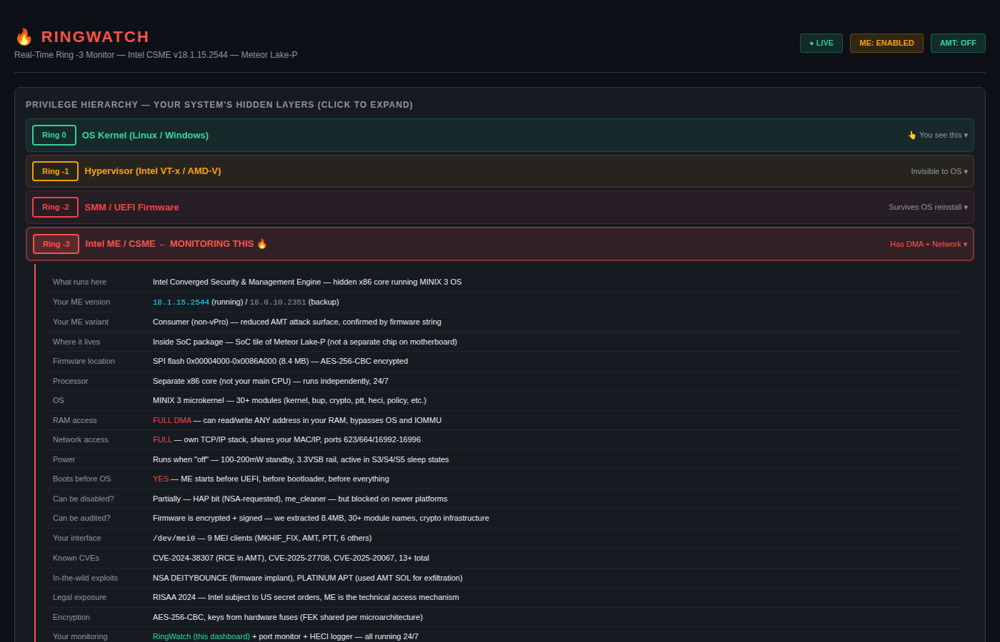

# RingWatch — Real-Time Ring -3 Monitor

## Dashboard




Monitors Intel Management Engine (ME/CSME) activity in real-time.
Read-only, zero risk — no system modifications.

## Architecture
- Backend: Python FastAPI (port 8849)
- Frontend: React + Mantine (same stack as PITBULL)
- Polling: sysfs + HECI probe + dmesg + lsof + network

## Run
```bash
cd backend && python3 -m uvicorn app.main:app --port 8849
# Frontend: cd frontend && npm run dev
```

## Dashboard: http://localhost:8849/

## License

MIT — see [LICENSE](LICENSE). Copyright (c) 2026 Dan Vladoiu.
